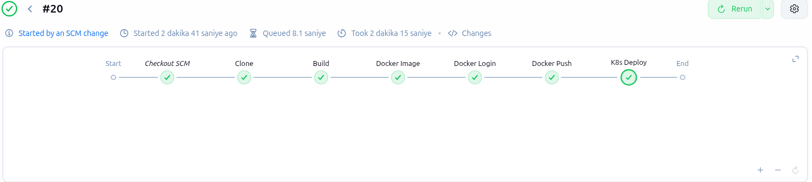
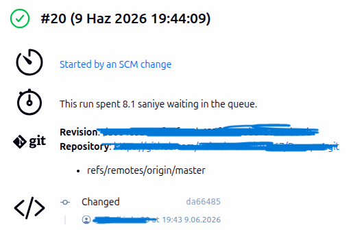
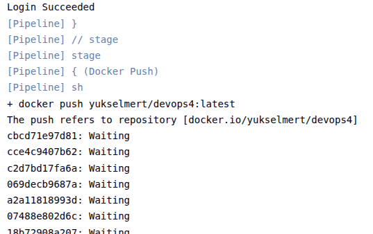
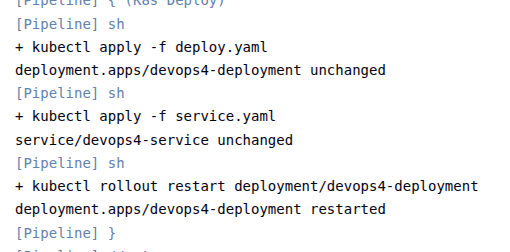
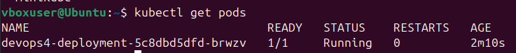
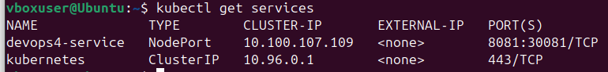
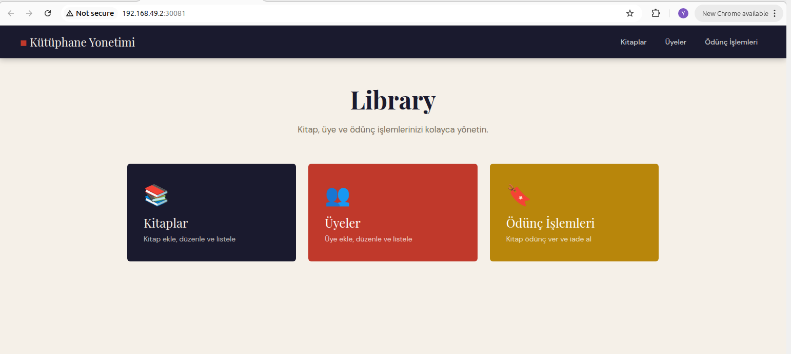
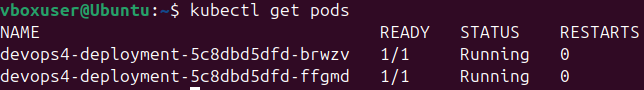

# 📚 Library Management System – Spring Boot
 
## 📌 Project Overview
 
This project is a **Spring Boot web application** developed for **SWE304 Project Study 4 (2026)**.
 
It implements a **CI/CD pipeline using Jenkins and Kubernetes (Minikube)**, where every push to the GitHub repository automatically triggers the pipeline — building, containerizing, pushing to DockerHub, and deploying to a local Kubernetes cluster.
 
The application is a **Library Management System** where users can manage books, members, and borrowing operations. It features both a web interface and REST API endpoints.
 
---
 
## 🛠️ Technology Stack
 
| Layer | Technology |
|---|---|
| Language | Java |
| Framework | Spring Boot |
| Build Tool | Gradle |
| Frontend | Thymeleaf |
| Containerization | Docker |
| Image Registry | DockerHub |
| CI/CD Server | Jenkins |
| Orchestration | Kubernetes (Minikube) |
| Source Control | GitHub |
 
---
 
## 🚀 Features
 
### 📖 Book Management
- Create, Read, Update, Delete books
### 👤 Member Management
- Create, Read, Update, Delete members
### 🔄 Borrow System
- Members can borrow and return books
### 🌐 Web Interface
- Server-side rendered pages using Thymeleaf
---
 
## ⚙️ CI/CD Pipeline (Jenkins)
 
Triggered automatically on every GitHub push or merge:
 
| Stage | Action |
|---|---|
| Clone | Clones the project from GitHub to the local machine |
| Build | Builds the project and generates a JAR file (`./gradlew bootJar`) |
| Docker Image | Builds a Docker image |
| Docker Login | Logs in to DockerHub using stored credentials |
| Docker Push | Pushes the image to DockerHub |
| K8s Deploy | Applies `deploy.yaml` and `service.yaml`, then restarts the deployment |
 
---
 
## 🏗️ Architecture
 
```
Developer → GitHub (push/merge)
               ↓ webhook trigger
           Jenkins Server (local)
               ↓
    ┌────────────────────────────────────┐
    │  Clone        → git pull           │
    │  Build        → gradlew bootJar    │
    │  Docker Image → docker build       │
    │  Docker Login → dockerhub login    │
    │  Docker Push  → ────────────────→ DockerHub
    │  K8s Deploy   → kubectl apply      │
    └────────────────────────────────────┘
               ↓
     Kubernetes (Minikube) ←── pulls image from DockerHub
               ↓
       Pod 1 | Pod 2 (scaled)
```
 
---
 
## 📁 Project Structure
 
```
├── src/
│   └── main/
│       └── java/
│           └── com/example/library/
│               └── LibraryApplication.java
├── docs/
│   ├── jenkins-pipeline.png
│   ├── jenkins-trigger.png
│   ├── jenkins-console.png
│   ├── k8s-deploy-console.png
│   ├── k8s-pods.png
│   ├── k8s-service.png
│   ├── app-running.png
│   └── k8s-scaled.png
├── deploy.yaml
├── service.yaml
├── Dockerfile
├── Jenkinsfile
├── build.gradle
└── README.md
```
 
---
 
## 🔧 Jenkinsfile
 
```groovy
pipeline {
    agent any
    environment {
        DOCKERHUB_CREDENTIALS = credentials('dockerhub-credentials')
        IMAGE_NAME = 'your-dockerhub-username/your-app'
    }
    stages {
        stage('Clone') {
            steps {
                git branch: 'master', url: 'https://github.com/your-username/your-repo.git'
            }
        }
        stage('Build') {
            steps {
                sh './gradlew bootJar'
            }
        }
        stage('Docker Image') {
            steps {
                sh 'docker build -t ${IMAGE_NAME}:latest .'
            }
        }
        stage('Docker Login') {
            steps {
                sh 'echo $DOCKERHUB_CREDENTIALS_PSW | docker login -u $DOCKERHUB_CREDENTIALS_USR --password-stdin'
            }
        }
        stage('Docker Push') {
            steps {
                sh 'docker push ${IMAGE_NAME}:latest'
            }
        }
        stage('K8s Deploy') {
            steps {
                sh 'kubectl apply -f deploy.yaml'
                sh 'kubectl apply -f service.yaml'
                sh 'kubectl rollout restart deployment/your-app-deployment'
            }
        }
    }
}
```
 
---
 
## ☸️ Kubernetes Manifests
 
### deploy.yaml
 
```yaml
apiVersion: apps/v1
kind: Deployment
metadata:
  name: your-app-deployment
spec:
  replicas: 1
  selector:
    matchLabels:
      app: your-app
  template:
    metadata:
      labels:
        app: your-app
    spec:
      containers:
        - name: your-app
          image: your-dockerhub-username/your-app:latest
          imagePullPolicy: Always
          ports:
            - containerPort: 8081
```
 
### service.yaml
 
```yaml
apiVersion: v1
kind: Service
metadata:
  name: your-app-service
spec:
  type: NodePort
  selector:
    app: your-app
  ports:
    - port: 8081
      targetPort: 8081
      nodePort: 30081
```
 
---
 
## ☸️ Kubernetes (Minikube) Commands
 
```bash
# Start Minikube
minikube start
 
# Apply manifests
kubectl apply -f deploy.yaml
kubectl apply -f service.yaml
 
# Check pod status
kubectl get pods
 
# Check services
kubectl get services
 
# Access the application
minikube service your-app-service
 
# Scale to 2 pods
kubectl scale deployment your-app-deployment --replicas=2
kubectl get pods
```
 
---
 
## 🧪 How to Run Locally
 
1. Start Minikube:
```bash
minikube start
```
 
2. Build the project:
```bash
./gradlew bootJar
```
 
3. Build and run with Docker:
```bash
docker build -t your-dockerhub-username/your-app:latest .
docker run -p 8081:8081 your-dockerhub-username/your-app:latest
```
 
Application runs at: `http://localhost:8081`
 
---
 
## 📷 Deployment Proof
 
### ✅ Jenkins Pipeline – All Stages Passing

 
---
 
### 🔁 Jenkins – Triggered by GitHub Push

 
---
 
### 📋 Jenkins Console – Docker Push

 
---
 
### 📋 Jenkins Console – K8s Deploy

 
---
 
### ☸️ Kubernetes Pods Running

 
---
 
### 🔌 Kubernetes Service

 
---
 
### 🌍 Application Running on Kubernetes

 
---
 
### 📈 Application Scaled to 2 Pods

 
---
 
## 🧠 Learning Outcomes
 
- Jenkins CI/CD pipeline setup and configuration
- GitHub webhook integration with Jenkins
- Docker image build and DockerHub push automation
- Kubernetes Deployment and Service manifest authoring
- Minikube local cluster management
- Horizontal pod scaling with `kubectl scale`
- Spring Boot web application development
- Thymeleaf server-side rendering
- Gradle build lifecycle management
